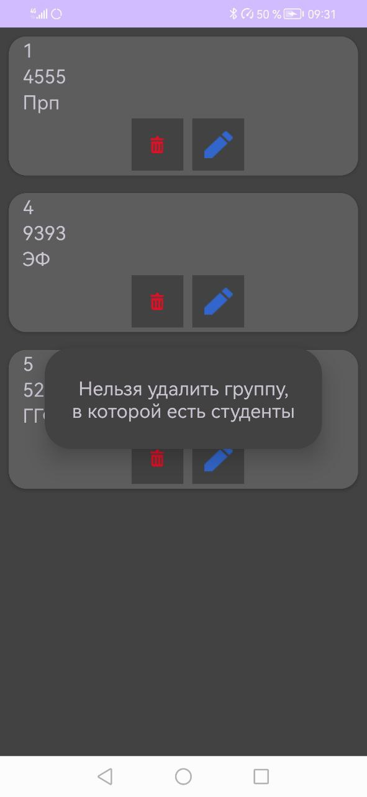

# StudentDB
# О приложении
Было необходимо реализовать систему ввода и отображения информации о студентах института,
включающую следующие сущности и их атрибуты:
+ Студент

  + Имя
  + Фамилия
  + Отчество
  + Дата рождения
  + Группа
  
+ Группа

  + Номер
  + Название факультета
  
___
Система должна иметь следующие функции:
+ Отображение списка групп
+ Добавление новой группы, редактирование и удаление существующей
+ Отображение списка студентов
+ Фильтрация списка студентов по фамилии и по номеру группы
+ Добавление нового студента, редактирование и удаление существующего
+ Система должна иметь защиту от удаления группы, содержащей студентов
___
# Используемый стек
+ 
+ 
+ Android SDK
+ Room
___
# Витрина скриншотов

  
  
  
  
  
  
  
  
  

